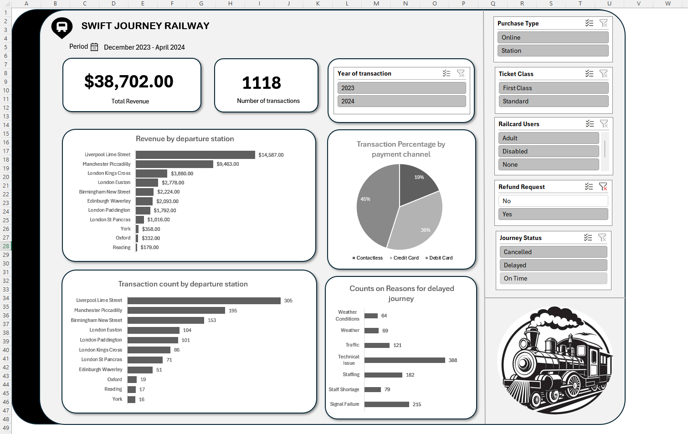

# Railway Ticket Sales and Journey Analysis 2023-2024

## Overview
This repository contains an in-depth analysis of a UK Railway dataset from 2023-2024, covering 31,653 transactions on ticket purchases, journeys, delays, and refunds. The project cleans, processes, and analyzes data to reveal insights into revenue, purchase behaviors, operational issues, and station performance. Built in Microsoft Excel, it demonstrates data wrangling, exploratory data analysis (EDA), and visualization skills, suitable for a data analysis or transportation analytics portfolio.

## Project Description
The dataset includes transaction details like purchase dates, payment methods, ticket types, journey statuses, delay reasons, and refunds. Key tasks include:
- **Data Cleaning**: Converted serial dates to weekdays/years, standardized delay reasons (e.g., "Null" for none), and ensured categorical consistency.
- **Analysis**: Aggregated metrics: total revenue (£741,921), transactions (31,653), average purchase time (~midday), payment breakdowns (Credit Card: 19,136), and delays (4,172, led by Weather: 1,372).
- **Visualizations**: Bar charts (revenue by station), pie charts (payment methods), stacked bars (delays by reason), and line charts (transactions by weekday) using Excel’s charting tools.
- **Insights**: Online purchases (58%) and Credit Cards (60%) dominate; delays affect 13% of journeys; major stations (e.g., London Kings Cross: £199,650) drive revenue.

## Project Screenshot
  

## Key Findings
- **Revenue**: Total £741,921 from 31,653 transactions; non-railcard users contribute 77% (£573,697).
- **Purchases**: Online (18,521), stations (13,132); Sundays peak (4,676 transactions).
- **Operations**: Delays (4,172): Weather (1,372), Signal Failure (970); refunds (1,118, 3.5%).
- **Stations**: London Kings Cross leads (£199,650, 4,229 departures); Liverpool Lime Street (£135,274).
- **Trends**: Weekend activity higher; digital shift evident.

## Tools and Skills
- **Tools**: Microsoft Excel (data cleaning, pivot tables, charting).
- **Skills**: Data wrangling, EDA, visualization, operational analysis.
